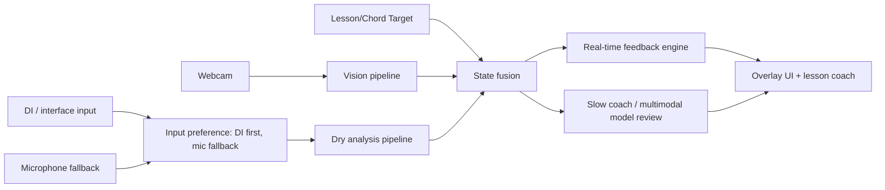
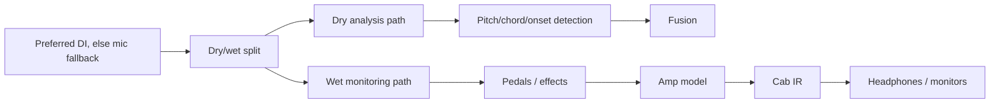

# Initial Architecture Hypothesis

This is a placeholder architecture before the deep research reports land.

## Likely architecture

## Real-time path

- Browser or desktop captures video plus the best available guitar audio source: **direct DI/interface first, external mic second, built-in mic last**.
- Audio path handles pitch/onset/chord detection locally for low latency from the dry/clean signal.
- Vision path detects guitar/fretboard/fingers locally or via an optimized model.
- Fusion compares detected state against target chord/tab.
- UI highlights correct/incorrect strings, frets, notes, and timing.

## Slow coaching path

A powerful multimodal model can analyze clips, summarize problems, generate practice plans, and explain technique. It may not be the best first component for frame-by-frame low-latency correction unless streaming multimodal latency and cost are acceptable.

## Optional tone/amp monitoring path

The amp-modeling research adds a parallel **tone/pedal engine** without changing the core correctness loop:

Correctness should stay on the dry/clean analysis path; amp/cab/pedal processing is for motivating, low-latency monitoring and practice feel. See [`product-vision-direct-capture-tone.md`](../product/product-vision-direct-capture-tone.md) and [`amp-modeling-and-tone-engine-research.md`](../research/amp-modeling-and-tone-engine-research.md).

## Early risk areas

- Exact finger-to-string/fret assignment from a single webcam angle.
- Polyphonic guitar transcription from laptop microphone.
- Lighting, occlusion, guitar type, tuning, capo, and camera calibration.
- Need for annotated data if existing models are insufficient.
